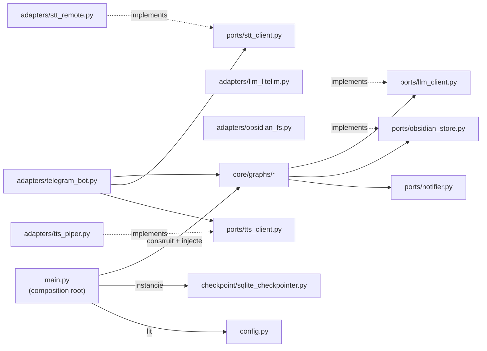
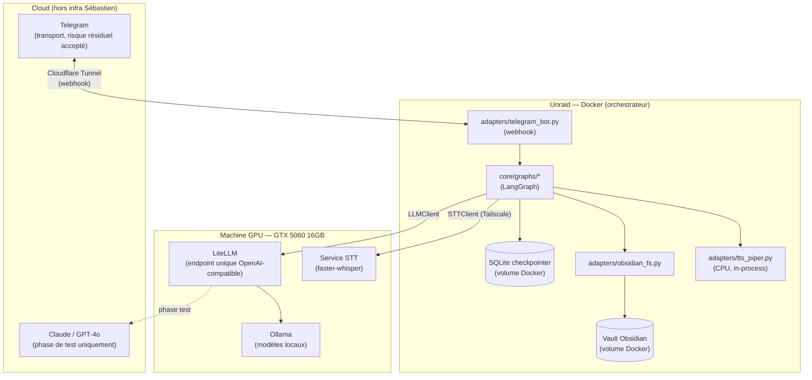

# Architecture Spine — Assistant Trajet quotidien

**Résolution de PRD Open Question #1 (n8n vs OpenClaw) :** ni l'un ni l'autre. Le PRD laissait le choix ouvert ; l'architecture tranche pour **Python custom + LangGraph**, seule option garantissant par construction le séquencement strict qu'exigent FR-4/5/6 (voir AD-8) — n8n et OpenClaw reposent tous deux sur la qualité du prompt pour ça. Détail complet et alternatives écartées : addendum du brief, section "Choix d'orchestration — Résolu en phase architecture".

## Design Paradigm

**Hexagonal (ports & adapters).** Le cœur (`core/`) contient la logique de chaque flux comme un graphe d'états **LangGraph** — chaque étape du bilan est un node, chaque transition une arête, l'état est explicite et persisté (AD-2). Le cœur ne connaît que des interfaces (`ports/`) : jamais Telegram, jamais un SDK LLM, jamais le système de fichiers directement. Un **composition root** (`main.py`) assemble au démarrage : il construit les adaptateurs, le checkpointer, et injecte le tout dans les graphes — les graphes ne construisent ni n'importent jamais leurs propres dépendances.

| Couche | Rôle | Namespace |
| --- | --- | --- |
| Core | Graphes de flux (state machines), règles de séquencement | `core/` |
| Ports | Interfaces abstraites (contrats) | `ports/` |
| Adapters | Implémentations concrètes (Telegram, LiteLLM, Obsidian, STT, TTS) | `adapters/` |
| Composition root | Assemblage au démarrage (wiring, config, checkpointer) | `main.py` |

## Invariants & Rules



### AD-1 — Direction de dépendance (frontière core/ports/adapters)

- **Binds:** tous les modules
- **Prevents:** la logique métier des flux se liant directement à une librairie externe, à `config.py`, ou au checkpointer — rendant tout remplacement coûteux à cause de dépendances éparpillées
- **Rule:** `core/` n'importe que des symboles de `ports/` (jamais `config.py`, jamais `checkpoint/`, jamais une librairie externe). `adapters/` implémentent `ports/` et sont seuls autorisés à importer des librairies externes. Seuls `adapters/telegram_bot.py` et `main.py` peuvent importer `core/graphs/*`. `main.py` (composition root) est le seul module à importer `checkpoint/`, `config.py`, et à instancier les adaptateurs — il les injecte dans les graphes à la construction, jamais l'inverse.

### AD-2 — Portée du checkpointer (isolation d'état par flux) `[ADOPTED]`

- **Binds:** FR-8, FR-9, tous les graphes de flux
- **Prevents:** un flux lisant l'état de conversation d'un autre flux ou d'un autre jour
- **Rule:** le checkpointer LangGraph (backend SQLite, un seul fichier local, monté en volume Docker — voir Consistency Conventions) est adressé par `thread_id = f"{chat_id}:{date}:{flow_type}"`. Cette clé n'est jamais réutilisée entre deux `flow_type` différents ni entre deux dates. Aucun code ne doit lire un `thread_id` autre que celui de l'exécution en cours. Un seul opérateur (Sébastien), un seul process : pas de contrat de concurrence d'accès requis pour v1.

### AD-3 — La fiche du jour est le canal de continuité inter-flux ; lecture historique distincte pour l'analyse de patterns

- **Binds:** FR-8, FR-10, FR-11, tous les graphes de flux
- **Prevents:** deux flux développés indépendamment inventant chacun leur propre façon de se transmettre de l'information ; `patterns.py` contournant le port en lisant le filesystem directement pour obtenir plusieurs jours d'historique
- **Rule:** `ports.ObsidianStore` expose deux capacités distinctes : `read_today()` (fiche du jour courant — seule méthode utilisée par matin/midi/soir pour la continuité, AD-8) et `read_range(start, end)` (lecture historique multi-jours — seule méthode utilisée par `patterns.py`, jamais par les trois autres flux). Le checkpointer d'un `flow_type` n'est jamais lu par un autre `flow_type`. Mécanique exacte de sélection des entrées pertinentes dans `read_range()` : Deferred (Open Question #2 du PRD).

### AD-4 — Appel LLM isolé via LiteLLM, capacités communes uniquement

- **Binds:** FR-16, tous les appels LLM (flux + analyse de patterns)
- **Prevents:** le code des flux se liant à un SDK ou un modèle spécifique ; un flux s'appuyant sur une capacité (function-calling, streaming) disponible chez un fournisseur routé par LiteLLM mais pas chez un autre, cassant silencieusement au changement de routage
- **Rule:** tout appel LLM passe par `ports.LLMClient`, dont l'unique adaptateur est un client SDK OpenAI pointé sur `LITELLM_BASE_URL` (variable d'environnement, machine GPU). Le routage vers Ollama (local) ou Claude/GPT-4o (API, phase de test) est une config LiteLLM côté machine GPU — jamais un changement de code côté orchestrateur. `core/` ne peut dépendre que des capacités garanties par les trois backends routés : complétion de chat simple (prompt → texte), sans supposer streaming ni function-calling.

### AD-5 — STT et TTS sont deux adaptateurs indépendants, sur des hôtes différents

- **Binds:** FR-3, tous les flux (entrée/sortie vocale)
- **Prevents:** supposer que STT et TTS partagent un runtime ou un emplacement — ce n'est pas le cas
- **Rule:** `ports.STTClient` est implémenté par un adaptateur HTTP distant (`adapters/stt_remote.py`, appelle le service faster-whisper sur la machine GPU via Tailscale). `ports.TTSClient` est implémenté par un adaptateur in-process (`adapters/tts_piper.py`, Piper tourne sur l'orchestrateur, CPU). Les deux sont remplaçables indépendamment sans toucher `core/`.

### AD-6 — Écriture atomique + notification sur échec technique `[ADOPTED]`

- **Binds:** FR-15, l'ensemble du cycle de vie d'un flux (de la réception du message à l'écriture finale)
- **Prevents:** une fiche du jour partiellement écrite ; un échec technique silencieux, y compris hors de `core/` (ex. service STT injoignable, avant même qu'un flux démarre)
- **Rule:** `ObsidianStore.write()` est tout-ou-rien (écriture fichier temporaire + renommage atomique). Toute exception technique (fichier inaccessible, service réseau injoignable, process qui plante) survenant n'importe où dans le cycle de vie d'un flux — y compris dans `adapters/telegram_bot.py` avant l'entrée dans `core/` — déclenche une notification Telegram via `ports.Notifier` ; aucune étape ne se termine sur une erreur technique sans passer par ce chemin. **Hors périmètre de cet AD** (voir AD-8) : transcription vide/incohérente (FR-13) et message hors-sujet/ambigu (FR-14) — ce sont des branches conversationnelles normales, pas des échecs techniques.

### AD-7 — Frontière du transport et contrôle d'accès `[ADOPTED]`

- **Binds:** FR-1, FR-2, FR-3
- **Prevents:** un `chat_id` non autorisé atteignant la logique de flux, ou détectant même l'existence du bot ; une réponse texte à un message vocal ou l'inverse ; un déclenchement de flux hors action explicite de Sébastien
- **Rule:** la vérification du `chat_id` a lieu dans `adapters/telegram_bot.py`, avant tout appel à `core/` ; un `chat_id` non autorisé ne reçoit strictement aucune réponse (FR-1). La règle vocal-in→vocal-out / texte-in→texte-out est appliquée par branchement dans cet adaptateur, jamais à l'intérieur des graphes de flux. Seuls les 3 boutons du clavier Telegram déclenchent un flux — aucun scheduler, aucun trigger géolocalisé n'existe dans le système (FR-2, cf. Non-Goals du PRD).

### AD-8 — Séquencement strict : machine à états, pas discipline de prompt

- **Binds:** FR-4, FR-5, FR-6, FR-13, FR-14 — la raison même du choix du paradigme (voir note de résolution en tête de document)
- **Prevents:** une étape sautée, une question déjà répondue reposée, une relance répétée sur un point déjà reformulé une fois
- **Rule:** chaque flux (`matin.py`, `midi.py`, `soir.py`) encode ses étapes comme des nodes LangGraph distincts et ordonnés — l'état du graphe (pas le prompt) détermine quelle étape est active ; un node ne peut transitionner vers l'étape suivante qu'après avoir enregistré une réponse pour l'étape courante. Chaque point du bilan soir porte un compteur de reformulation dans l'état du graphe, plafonné à 1 (FR-6) : au-delà, le node accepte la réponse telle quelle et avance. **FR-13** (transcription vide/incohérente) et **FR-14** (message hors-sujet/ambigu) sont des boucles de validation à l'intérieur du node courant — elles redemandent sans avancer l'état — jamais un chemin d'erreur technique (voir AD-6).

### AD-9 — Aucune automatisation silencieuse sur le schéma ou l'historique `[ADOPTED]`

- **Binds:** FR-12, `patterns.py`
- **Prevents:** un nouveau champ structuré ajouté au schéma sans validation humaine ; une fiche passée réécrite programmatiquement
- **Rule:** `patterns.py` peut *proposer* un champ structuré (message à Sébastien), jamais l'appliquer lui-même — l'ajout au schéma (AD-10) est un acte manuel ou semi-automatisé déclenché séparément, hors de l'exécution du graphe `patterns`. Aucun code du système n'a de chemin d'écriture vers une fiche dont la date n'est pas celle du jour courant. Mécanisme précis de la proposition : Deferred (Open Question #4 du PRD).

### AD-10 — Schéma de la fiche du jour (résout PRD Open Question #5)

- **Binds:** FR-7, tous les flux (lecture/écriture via `ObsidianStore`)
- **Prevents:** deux flux inventant chacun un nom ou un type de champ différent pour le même concept (ex. `energie: 7` vs `energy_level: {score, note}`) — exactement la divergence qu'AD-3 existe pour empêcher, mais qui restait possible tant qu'aucun schéma n'était fixé
- **Rule:** frontmatter YAML de `{YYYY-MM-DD}.md`, champs fixes tous optionnels (présents seulement une fois écrits par un flux) :

  ```yaml
  ---
  date: 2026-09-03            # ISO 8601, clé de la fiche
  plan_matin: string           # résumé confirmé du flux matin (2-3 lignes)
  ajustement_midi: string       # résumé confirmé du flux midi (1 ligne)
  taches:                        # prévu vs fait, alimenté par le flux soir
    - texte: string
      statut: fait | en_cours | pas_fait
  imprevus: string                # texte libre, flux soir
  suivis_demain:                   # liste, flux soir
    - texte: string
      avec_qui: string | null
  feeling_general: string           # texte libre (pas d'échelle imposée), flux soir
  procrastination_estimee_min: int   # minutes, flux soir
  ---
  {corps de texte libre — champ "Autres", non structuré}
  ```

  Un champ structuré ajouté via AD-9 s'ajoute à cette liste sans jamais renommer ni retyper un champ existant (breaking change interdit sans migration explicite, hors scope v1).

## Consistency Conventions

| Concern | Convention |
| --- | --- |
| Naming (entités, fichiers, interfaces) | `flow_type ∈ {matin, midi, soir, patterns}` ; `thread_id = "{chat_id}:{date}:{flow_type}"` ; fiche du jour `{YYYY-MM-DD}.md` ; ports nommés `<Capacité>Client` ou `<Capacité>Store` ; adaptateurs nommés `<impl>_<port>.py` |
| Data & formats (dates, erreurs) | Dates au format ISO 8601 (`YYYY-MM-DD`). Schéma de la fiche du jour : AD-10. Toute exception remontée à l'utilisateur porte un message Telegram en français, jamais de stack trace exposée ; le détail technique va au log, pas au message |
| Contrat des ports | Tous synchrones. Une seule exception technique projet (`FlowInfraError`) levée par tout adaptateur en cas d'échec — jamais une exception spécifique à une librairie qui fuiterait dans `core/` |
| Persistance (Docker, Unraid) | Le fichier SQLite du checkpointer et le vault Obsidian sont montés en **volumes Docker sur stockage hôte Unraid** — jamais dans le filesystem éphémère du conteneur. Un rebuild du conteneur ne doit jamais effacer l'historique |
| State & cross-cutting (config, auth, logs) | Configuration exclusivement par variables d'environnement (`.env`, gitignored) : `LITELLM_BASE_URL`, `STT_SERVICE_URL`, `TELEGRAM_BOT_TOKEN`, `AUTHORIZED_CHAT_ID`, `OBSIDIAN_VAULT_PATH`. Auth = `chat_id` unique vérifié à la frontière transport (AD-7). Chaque transition d'étape logue `flow_type` + `thread_id` + horodatage (base de l'instrumentation de latence, voir Deferred) |
| Environnements | Phase de test et production partagent la même topologie (2 hôtes, mêmes adaptateurs) — seule la config de routage LiteLLM change (Claude/GPT-4o en test, Ollama local en prod). Pas d'environnement de "staging" distinct pour v1 (usage personnel, un seul opérateur) |

## Stack

| Name | Version |
| --- | --- |
| Python | 3.12+ (dernier correctif 3.12.14) |
| LangGraph | 1.2.11 |
| python-telegram-bot | 22.8 (extra `[webhooks]`) |
| LiteLLM (proxy, machine GPU) | ≥1.83.0 (actuel 1.99.0) — jamais en-deçà de 1.83.0 (incident supply-chain corrigé) |
| Ollama (machine GPU) | 0.33.x |
| faster-whisper (service STT, machine GPU) | 1.2.1 — pas de nouvelle release depuis ~10 mois à la date d'écriture ; toujours la version recommandée, à re-vérifier au déploiement |
| Piper (TTS, in-process orchestrateur) | OHF-Voice/piper1-gpl 1.7.0 — **changement de licence** : le dépôt `rhasspy/piper` (MIT) d'origine est archivé (oct. 2025), le fork actif `OHF-Voice/piper1-gpl` est en GPL-3.0 |
| sqlite3 | stdlib Python (checkpointer LangGraph) |
| openai (SDK, client HTTP vers LiteLLM) | 3.x (dernière stable) |
| Tailscale | réseau point-à-point Unraid ↔ machine GPU (contrainte non négociable, déjà décidée) |
| Cloudflare Tunnel | exposition du webhook Telegram sans port ouvert (contrainte non négociable, déjà décidée) |

## Structural Seed



```text
assistant-trajet/
  core/
    graphs/            # graphes LangGraph : matin.py, midi.py, soir.py, patterns.py
    state.py           # schémas d'état par flux (dont compteurs de reformulation, AD-8)
  ports/
    llm_client.py
    stt_client.py
    tts_client.py
    obsidian_store.py   # read_today(), read_range(), write() — AD-3
    notifier.py
  adapters/
    llm_litellm.py      # client OpenAI-SDK -> LiteLLM
    stt_remote.py         # appel HTTP -> service STT (machine GPU)
    tts_piper.py            # Piper in-process
    obsidian_fs.py            # lecture/écriture vault, écriture atomique, schéma AD-10
    telegram_bot.py            # transport webhook, vérification chat_id, routage
  checkpoint/
    sqlite_checkpointer.py      # wiring checkpointer LangGraph, schéma thread_id (AD-2)
  config.py                      # chargement variables d'environnement
  main.py                         # composition root — construit adaptateurs + checkpointer, injecte dans les graphes, sert le webhook
```

## Capability → Architecture Map

| Capability / Area | Lives in | Governed by |
| --- | --- | --- |
| Interface et accès (FR-1, FR-2, FR-3) | `adapters/telegram_bot.py` | AD-7 |
| Flux matin / midi / soir — déroulé (FR-4, FR-5, FR-6) | `core/graphs/matin.py`, `midi.py`, `soir.py` | AD-1, AD-2, AD-8 |
| Continuité et mémoire (FR-8, FR-9) | `adapters/obsidian_fs.py`, `checkpoint/sqlite_checkpointer.py` | AD-2, AD-3 |
| Fiche journalière — schéma (FR-7) | `adapters/obsidian_fs.py` | AD-10 |
| Analyse de patterns (FR-10, FR-11) | `core/graphs/patterns.py` | AD-3, AD-8 (déclenchement manuel) |
| Nouveau champ — proposition sans auto-application (FR-12) | `core/graphs/patterns.py` | AD-9 |
| Validation conversationnelle (FR-13, FR-14) | `core/graphs/*` (boucles internes aux nodes) | AD-8 |
| Échec technique (FR-15) | `ports/notifier.py`, `adapters/obsidian_fs.py` | AD-6 |
| Indépendance LLM (FR-16) | `ports/llm_client.py`, `adapters/llm_litellm.py` | AD-4 |

## Deferred

- **Borne de temps de réponse** (§5 PRD) — qualitatif par choix du PRD ; instrumentation dès le premier déploiement (logs par étape, voir Consistency Conventions), mesure empirique pendant la séquence de tests du brief. Pas de chiffre fixé ici.
- **Mécanique exacte de la recherche ciblée** dans `read_range()` pour l'analyse de patterns (FR-11) — Open Question #2 du PRD.
- **Mécanisme précis de la proposition/ajout d'un nouveau champ structuré** (FR-12, AD-9) — manuel ou semi-automatisé — Open Question #4 du PRD.
- **Migration TTS vers Coqui XTTS v2** si Piper devient un irritant — nécessiterait de déplacer l'adaptateur TTS vers la machine GPU (actuellement in-process sur l'orchestrateur, AD-5).
- **Détails de credentials LiteLLM/Telegram** (structure exacte des secrets, rotation) — laissé à l'implémentation, gouverné par la contrainte "jamais en clair, jamais commit" (§5 PRD).
- **Nettoyage/rétention du checkpointer SQLite** (anciens threads) — non bloquant pour v1, à revisiter si la taille du fichier devient un problème.
- **Déclenchement proactif futur** (géolocalisation, horaire) — explicitement hors scope v1 (Non-Goals du PRD) ; AD-7/AD-8 n'ont pas à en tenir compte tant que ce n'est pas repriorisé.
