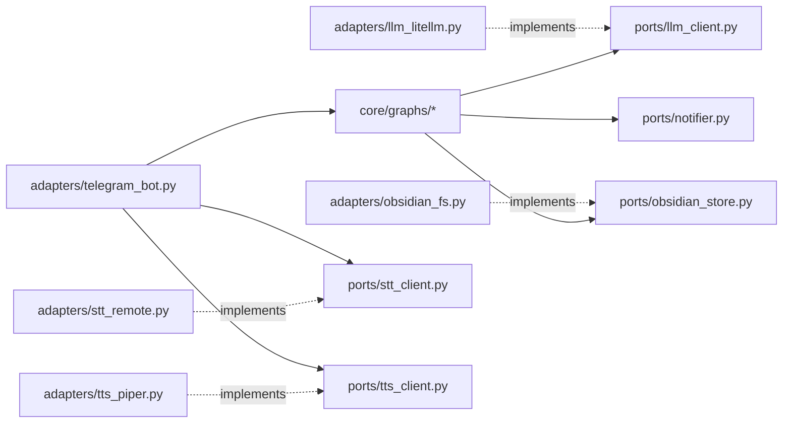

# Architecture Spine — Assistant Trajet quotidien

## Design Paradigm

**Hexagonal (ports & adapters).** Le cœur (`core/`) contient la logique de chaque flux comme un graphe d'états **LangGraph** — chaque étape du bilan est un node, chaque transition une arête, l'état est explicite et persisté (voir AD-2). Le cœur ne connaît que des interfaces (`ports/`) : jamais Telegram, jamais un SDK LLM, jamais le système de fichiers directement. Tout ce qui touche le monde extérieur est un `adapters/` qui implémente un port.

| Couche | Rôle | Namespace |
| --- | --- | --- |
| Core | Graphes de flux (state machines), règles de séquencement | `core/` |
| Ports | Interfaces abstraites (contrats) | `ports/` |
| Adapters | Implémentations concrètes (Telegram, LiteLLM, Obsidian, STT, TTS) | `adapters/` |

## Invariants & Rules



### AD-1 — Direction de dépendance (frontière core/ports/adapters)

- **Binds:** tous les modules
- **Prevents:** la logique métier des flux se liant directement à une librairie externe (Telegram, SDK LLM, whisper, filesystem), rendant tout remplacement (modèle, moteur vocal, transport) coûteux à cause de dépendances éparpillées
- **Rule:** `core/` n'importe que des symboles de `ports/`. `adapters/` implémentent `ports/` et sont seuls autorisés à importer des librairies externes. Seul `adapters/telegram_bot.py` peut importer `core/graphs/*` (point d'entrée).

### AD-2 — Portée du checkpointer (isolation d'état par flux) `[ADOPTED]`

- **Binds:** FR-8, FR-9, tous les graphes de flux
- **Prevents:** un flux lisant l'état de conversation d'un autre flux ou d'un autre jour
- **Rule:** le checkpointer LangGraph (backend SQLite, un seul fichier local) est adressé par `thread_id = f"{chat_id}:{date}:{flow_type}"`. Cette clé n'est jamais réutilisée entre deux `flow_type` différents ni entre deux dates. Aucun code ne doit lire un `thread_id` autre que celui de l'exécution en cours.

### AD-3 — La fiche du jour est le seul canal de continuité inter-flux `[ADOPTED]`

- **Binds:** FR-8, tous les graphes de flux
- **Prevents:** deux flux développés indépendamment inventant chacun leur propre façon de se transmettre de l'information (l'un lisant le checkpointer de l'autre, par exemple)
- **Rule:** un flux ne connaît le contenu produit par un flux précédent que via `ObsidianStore.read_today()`. Le checkpointer d'un `flow_type` n'est jamais lu par un autre `flow_type`.

### AD-4 — Appel LLM isolé via LiteLLM

- **Binds:** FR-16, tous les appels LLM (flux + analyse de patterns)
- **Prevents:** le code des flux se liant à un SDK ou un modèle spécifique, cassant la contrainte "un seul point de swap"
- **Rule:** tout appel LLM passe par `ports.LLMClient`, dont l'unique adaptateur est un client SDK OpenAI pointé sur `LITELLM_BASE_URL` (variable d'environnement, machine GPU). Le routage vers Ollama (local) ou Claude/GPT-4o (API, phase de test) est une config LiteLLM côté machine GPU — jamais un changement de code côté orchestrateur.

### AD-5 — STT et TTS sont deux adaptateurs indépendants, sur des hôtes différents

- **Binds:** FR-3, tous les flux (entrée/sortie vocale)
- **Prevents:** supposer que STT et TTS partagent un runtime ou un emplacement — ce n'est pas le cas
- **Rule:** `ports.STTClient` est implémenté par un adaptateur HTTP distant (`adapters/stt_remote.py`, appelle le service faster-whisper sur la machine GPU via Tailscale). `ports.TTSClient` est implémenté par un adaptateur in-process (`adapters/tts_piper.py`, Piper tourne sur l'orchestrateur, CPU). Les deux sont remplaçables indépendamment sans toucher `core/`.

### AD-6 — Écriture atomique de la fiche du jour + notification d'erreur `[ADOPTED]`

- **Binds:** FR-13, FR-14, FR-15, tous les flux
- **Prevents:** une fiche du jour partiellement écrite, ou un échec technique silencieux
- **Rule:** `ObsidianStore.write()` est tout-ou-rien (écriture fichier temporaire + renommage atomique). Toute exception levée avant une écriture réussie déclenche une notification Telegram via `ports.Notifier` avant la fin du flux — aucun flux ne se termine sur erreur sans passer par ce chemin.

### AD-7 — Frontière du transport et contrôle d'accès `[ADOPTED]`

- **Binds:** FR-1, FR-2, FR-3
- **Prevents:** un `chat_id` non autorisé atteignant la logique de flux ; une réponse texte à un message vocal ou l'inverse
- **Rule:** la vérification du `chat_id` a lieu dans `adapters/telegram_bot.py`, avant tout appel à `core/`. La règle vocal-in→vocal-out / texte-in→texte-out est appliquée par branchement dans cet adaptateur, jamais à l'intérieur des graphes de flux.

## Consistency Conventions

| Concern | Convention |
| --- | --- |
| Naming (entités, fichiers, interfaces) | `flow_type ∈ {matin, midi, soir, patterns}` ; `thread_id = "{chat_id}:{date}:{flow_type}"` ; fiche du jour `{YYYY-MM-DD}.md` ; ports nommés `<Capacité>Client` ou `<Capacité>Store` ; adaptateurs nommés `<impl>_<port>.py` |
| Data & formats (dates, erreurs) | Dates au format ISO 8601 (`YYYY-MM-DD`). Toute exception remontée à l'utilisateur porte un message Telegram en français, jamais de stack trace exposée ; le détail technique va au log, pas au message |
| State & cross-cutting (config, auth, logs) | Configuration exclusivement par variables d'environnement (`.env`, gitignored) : `LITELLM_BASE_URL`, `STT_SERVICE_URL`, `TELEGRAM_BOT_TOKEN`, `AUTHORIZED_CHAT_ID`, `OBSIDIAN_VAULT_PATH`. Auth = `chat_id` unique vérifié à la frontière transport (AD-7). Chaque transition d'étape logue `flow_type` + `thread_id` + horodatage (base de l'instrumentation de latence, voir Deferred) |

## Stack

| Name | Version |
| --- | --- |
| Python | 3.12+ |
| LangGraph | 1.1.6 |
| python-telegram-bot | 22.8 (extra `[webhooks]`) |
| LiteLLM (proxy, machine GPU) | ≥1.83.0 (actuel 1.99.0) — jamais en-deçà de 1.83.0 (incident supply-chain corrigé) |
| Ollama (machine GPU) | 0.33.x |
| faster-whisper (service STT, machine GPU) | 1.2.1 |
| Piper (TTS, in-process orchestrateur) | OHF-Voice/piper1-gpl 1.6.0 — **changement de licence** : le dépôt `rhasspy/piper` (MIT) d'origine est archivé (oct. 2025), le fork actif `OHF-Voice/piper1-gpl` est en GPL-3.0 |
| sqlite3 | stdlib Python (checkpointer LangGraph) |
| openai (SDK, client HTTP vers LiteLLM) | dernière stable |

## Structural Seed

```mermaid
graph TB
  subgraph "Unraid — Docker (orchestrateur)"
    tg["adapters/telegram_bot.py<br/>(webhook)"]
    core["core/graphs/*<br/>(LangGraph)"]
    ckpt[("SQLite<br/>checkpointer")]
    obs["adapters/obsidian_fs.py"]
    vault[("Vault Obsidian<br/>(fiches du jour)")]
    tts["adapters/tts_piper.py<br/>(CPU, in-process)"]
    tg --> core
    core --> ckpt
    core --> obs --> vault
    core --> tts
  end
  subgraph "Machine GPU — GTX 5060 16GB"
    litellm["LiteLLM<br/>(endpoint unique OpenAI-compatible)"]
    ollama["Ollama<br/>(modèles locaux)"]
    stt["Service STT<br/>(faster-whisper)"]
    litellm --> ollama
  end
  subgraph "Cloud (hors infra Sébastien)"
    telegram_api["Telegram<br/>(transport, risque résiduel accepté)"]
    api_llm["Claude / GPT-4o<br/>(phase de test uniquement)"]
  end
  core -->|"LLMClient"| litellm
  litellm -.phase test.-> api_llm
  core -->|"STTClient (Tailscale)"| stt
  telegram_api <-->|"Cloudflare Tunnel<br/>(webhook)"| tg
```



```text
assistant-trajet/
  core/
    graphs/            # graphes LangGraph : matin.py, midi.py, soir.py, patterns.py
    state.py           # schémas d'état par flux
  ports/
    llm_client.py
    stt_client.py
    tts_client.py
    obsidian_store.py
    notifier.py
  adapters/
    llm_litellm.py      # client OpenAI-SDK -> LiteLLM
    stt_remote.py        # appel HTTP -> service STT (machine GPU)
    tts_piper.py           # Piper in-process
    obsidian_fs.py          # lecture/écriture vault, écriture atomique
    telegram_bot.py          # transport webhook, vérification chat_id, routage
  checkpoint/
    sqlite_checkpointer.py    # wiring checkpointer LangGraph, schéma thread_id
  config.py                    # chargement variables d'environnement
  main.py                       # point d'entrée (serveur webhook)
```

## Capability → Architecture Map

| Capability / Area | Lives in | Governed by |
| --- | --- | --- |
| Interface et accès (FR-1, FR-2, FR-3) | `adapters/telegram_bot.py` | AD-7 |
| Flux matin / midi / soir (FR-4, FR-5, FR-6) | `core/graphs/matin.py`, `midi.py`, `soir.py` | AD-1, AD-2, AD-3 |
| Continuité et mémoire (FR-7, FR-8, FR-9) | `adapters/obsidian_fs.py`, `checkpoint/sqlite_checkpointer.py` | AD-2, AD-3, AD-6 |
| Analyse de patterns (FR-10, FR-11, FR-12) | `core/graphs/patterns.py` | AD-1, AD-3 |
| Gestion des erreurs (FR-13, FR-14, FR-15) | `adapters/obsidian_fs.py`, `ports/notifier.py` | AD-6 |
| Indépendance LLM (FR-16) | `ports/llm_client.py`, `adapters/llm_litellm.py` | AD-4 |

## Deferred

- **Borne de temps de réponse** (§5 PRD) — qualitatif par choix du PRD ; instrumentation dès le premier déploiement (logs par étape, voir Consistency Conventions), mesure empirique pendant la séquence de tests du brief. Pas de chiffre fixé ici.
- **Schéma YAML exact de la fiche du jour** (noms de champs, types, convention de nommage) — Open Question #5 du PRD.
- **Mécanique exacte de la recherche ciblée** pour l'analyse de patterns (FR-11) — Open Question #2 du PRD.
- **Mécanisme précis d'ajout d'un nouveau champ structuré** (FR-12) — Open Question #4 du PRD.
- **Migration TTS vers Coqui XTTS v2** si Piper devient un irritant — nécessiterait de déplacer l'adaptateur TTS vers la machine GPU (actuellement in-process sur l'orchestrateur, AD-5).
- **Détails de credentials LiteLLM/Telegram** (structure exacte des secrets, rotation) — laissé à l'implémentation, gouverné par la contrainte "jamais en clair, jamais commit" (§5 PRD).
- **Nettoyage/rétention du checkpointer SQLite** (anciens threads) — non bloquant pour v1, à revisiter si la taille du fichier devient un problème.
